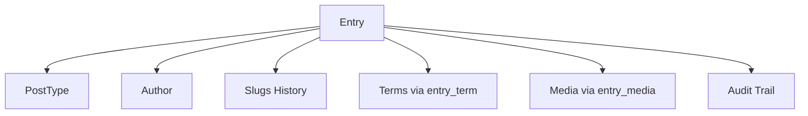
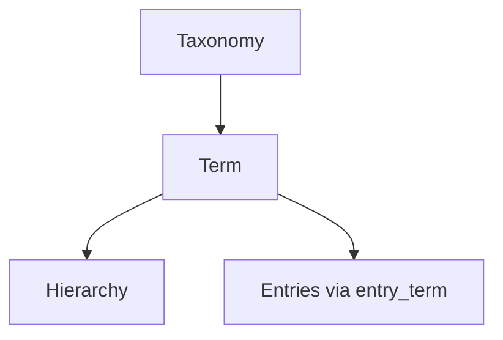
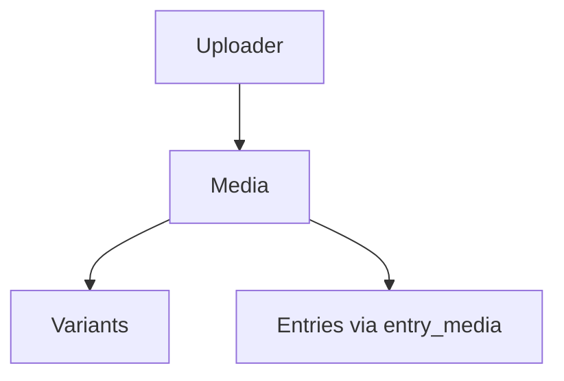

# Модель данных stupidCms

Полная схема сущностей и связей в stupidCms.

## ERD Diagram

Актуальная ERD-диаграмма генерируется автоматически из миграций:


> ⚠️ Если диаграмма не отображается, запустите `composer docs:gen` для генерации.

## Основные сущности

### Content Management

#### PostType

**Назначение**: Определяет тип контента (статья, событие, товар, страница).

**Таблица**: `post_types`

**Поля**:
- `id` (bigint, PK)
- `slug` (string, unique) — идентификатор типа (`article`, `page`, `event`)
- `name` (string) — название для админки ("Статья", "Событие")
- `template` (string, nullable) — шаблон вывода (для будущего)
- `options_json` (json) — настройки (fields, taxonomies, media_support)
- `created_at`, `updated_at`

**Связи**:
- `hasMany(Entry)` — записи этого типа

**Файл**: `app/Models/PostType.php`

---

#### Entry

**Назначение**: Запись контента (экземпляр PostType).

**Таблица**: `entries`

**Поля**:
- `id` (bigint, PK)
- `post_type_id` (bigint, FK → `post_types.id`)
- `author_id` (bigint, FK → `users.id`)
- `slug` (string, indexed) — текущий slug
- `title` (string)
- `data_json` (json) — кастомные поля
- `seo_json` (json) — SEO (title, description, og:*)
- `status` (enum: `draft`, `published`)
- `published_at` (datetime, nullable)
- `created_at`, `updated_at`, `deleted_at` (soft delete)

**Связи**:
- `belongsTo(PostType)` — тип контента
- `belongsTo(User, 'author_id')` — автор
- `hasMany(EntrySlug)` — история URL
- `belongsToMany(Term)` via `entry_term` — термины/категории
- `belongsToMany(Media)` via `entry_media` — медиафайлы

**Scopes**:
- `published()` — опубликованные (`status=published`, `published_at <= now`)
- `ofType($slug)` — записи конкретного типа

**Файл**: `app/Models/Entry.php`

---

#### EntrySlug

**Назначение**: История URL записи с поддержкой 301-редиректов.

**Таблица**: `entry_slugs`

**Поля**:
- `entry_id` (bigint, FK → `entries.id`, часть составного PK)
- `slug` (string, часть составного PK)
- `is_current` (boolean) — текущий ли slug
- `parent_slug` (string, nullable) — родительский slug для иерархии
- `created_at` (datetime)

**Primary Key**: composite `(entry_id, slug)`

**Индексы**:
- `slug` — для резолва URL
- `is_current` — для поиска текущего slug

**Связи**:
- `belongsTo(Entry)`

**Логика**:
При изменении slug entry:
1. Старый slug: `is_current = false`
2. Новый slug: создаётся с `is_current = true`
3. Резолв URL: ищет `slug` → если не current → 301 на current

**Файл**: `app/Models/EntrySlug.php`

---

### Taxonomy & Terms

#### Taxonomy

**Назначение**: Группа терминов (например, "Категории статей", "Теги", "Регионы").

**Таблица**: `taxonomies`

**Поля**:
- `id` (bigint, PK)
- `slug` (string, unique) — `categories`, `tags`
- `name` (string)
- `hierarchical` (boolean) — поддерживает ли древовидную структуру
- `created_at`, `updated_at`

**Связи**:
- `hasMany(Term)` — термины

---

#### Term

**Назначение**: Категория, тег, регион (элемент таксономии).

**Таблица**: `terms`

**Поля**:
- `id` (bigint, PK)
- `taxonomy_id` (bigint, FK → `taxonomies.id`)
- `slug` (string, indexed)
- `name` (string)
- `description` (text, nullable)
- `created_at`, `updated_at`

**Связи**:
- `belongsTo(Taxonomy)`
- `belongsToMany(Entry)` via `entry_term`
- `hasMany(TermTree, 'term_id')` — дочерние узлы в иерархии
- `hasMany(TermTree, 'parent_id')` — родительские узлы

**Файл**: `app/Models/Term.php`

---

#### TermTree

**Назначение**: Иерархия терминов (parent-child).

**Таблица**: `term_tree`

**Поля**:
- `term_id` (bigint, FK → `terms.id`, часть PK)
- `parent_id` (bigint, FK → `terms.id`, часть PK)
- `level` (int) — глубина вложенности
- `path` (string) — полный путь (например, `1/3/5`)

**Primary Key**: composite `(term_id, parent_id)`

**Файл**: `app/Models/TermTree.php`

---

### Media

#### Media

**Назначение**: Медиафайл (изображение, документ, видео).

**Таблица**: `media`

**Поля**:
- `id` (bigint, PK)
- `uploader_id` (bigint, FK → `users.id`)
- `filename` (string)
- `path` (string) — путь в хранилище
- `mime_type` (string)
- `size_bytes` (bigint)
- `meta_json` (json) — EXIF, dimensions, alt, title
- `created_at`, `updated_at`, `deleted_at`

**Связи**:
- `belongsTo(User, 'uploader_id')`
- `hasMany(MediaVariant)` — варианты (thumbnails)
- `belongsToMany(Entry)` via `entry_media`

**Файл**: `app/Models/Media.php`

---

#### MediaVariant

**Назначение**: Варианты изображения (thumbnail, medium, large).

**Таблица**: `media_variants`

**Поля**:
- `id` (bigint, PK)
- `media_id` (bigint, FK → `media.id`)
- `variant` (string) — `thumbnail`, `medium`, `large`
- `path` (string)
- `width` (int)
- `height` (int)
- `size_bytes` (bigint)
- `created_at`, `updated_at`

**Связи**:
- `belongsTo(Media)`

**Файл**: `app/Models/MediaVariant.php`

---

#### EntryMedia (Pivot)

**Назначение**: Связь Entry ↔ Media с метаданными.

**Таблица**: `entry_media`

**Поля**:
- `entry_id` (bigint, FK → `entries.id`)
- `media_id` (bigint, FK → `media.id`)
- `field_key` (string) — ключ поля (`featured_image`, `gallery`, etc.)
- `order` (int) — порядок в галерее

**Primary Key**: composite `(entry_id, media_id, field_key)`

**Файл**: `app/Models/EntryMedia.php`

---

### Routing & Redirects

#### Redirect

**Назначение**: Ручные 301-редиректы (не связанные с entry slugs).

**Таблица**: `redirects`

**Поля**:
- `id` (bigint, PK)
- `from_path` (string, unique)
- `to_path` (string)
- `status_code` (int, default: 301)
- `created_at`, `updated_at`

**Файл**: `app/Models/Redirect.php`

---

#### ReservedRoute

**Назначение**: Зарезервированные URL, недоступные для пользовательских slugs.

**Таблица**: `reserved_routes`

**Поля**:
- `id` (bigint, PK)
- `pattern` (string, unique) — `/api/*`, `/admin`, `/auth/*`
- `description` (text, nullable)
- `created_at`, `updated_at`

**Файл**: `app/Models/ReservedRoute.php`

---

#### RouteReservation

**Назначение**: Временные резервации URL (например, при создании entry в админке).

**Таблица**: `route_reservations`

**Поля**:
- `id` (bigint, PK)
- `path` (string, unique)
- `reserved_by_user_id` (bigint, FK → `users.id`)
- `expires_at` (datetime)
- `created_at`

**Файл**: `app/Models/RouteReservation.php`

---

### System

#### Option

**Назначение**: Настройки сайта (key-value store).

**Таблица**: `options`

**Поля**:
- `key` (string, PK)
- `value` (json)
- `autoload` (boolean) — загружать при старте приложения
- `created_at`, `updated_at`

**Использование**:
```php
option('site_name'); // helper
Option::set('site_name', 'My CMS');
```

**Файл**: `app/Models/Option.php`

---

#### User

**Назначение**: Пользователь с правами доступа.

**Таблица**: `users`

**Поля**:
- `id` (bigint, PK)
- `email` (string, unique)
- `password` (string, hashed)
- `name` (string)
- `role` (enum: `admin`, `editor`, `author`)
- `email_verified_at` (datetime, nullable)
- `created_at`, `updated_at`

**Связи**:
- `hasMany(Entry, 'author_id')` — созданные записи
- `hasMany(Media, 'uploader_id')` — загруженные медиа
- `hasMany(RefreshToken)` — токены обновления

**Файл**: `app/Models/User.php`

---

#### RefreshToken

**Назначение**: JWT refresh токены для продления сессии.

**Таблица**: `refresh_tokens`

**Поля**:
- `id` (bigint, PK)
- `user_id` (bigint, FK → `users.id`)
- `token` (string, unique, hashed)
- `expires_at` (datetime)
- `created_at`

**Файл**: `app/Models/RefreshToken.php`

---

#### Audit

**Назначение**: Лог изменений (audit trail).

**Таблица**: `audits`

**Поля**:
- `id` (bigint, PK)
- `user_id` (bigint, FK → `users.id`, nullable)
- `event` (string) — `created`, `updated`, `deleted`
- `auditable_type` (string) — класс модели
- `auditable_id` (bigint) — ID записи
- `old_values` (json, nullable)
- `new_values` (json)
- `ip_address` (string, nullable)
- `user_agent` (text, nullable)
- `created_at`

**Полиморфная связь**: `auditable` → любая модель

**Файл**: `app/Models/Audit.php`

---

#### Outbox

**Назначение**: Transactional outbox pattern для событий (интеграция с внешними системами).

**Таблица**: `outbox`

**Поля**:
- `id` (bigint, PK)
- `aggregate_type` (string) — `Entry`, `Media`
- `aggregate_id` (bigint)
- `event_type` (string) — `EntryPublished`, `MediaUploaded`
- `payload` (json)
- `published_at` (datetime, nullable)
- `created_at`

**Файл**: `app/Models/Outbox.php`

---

### Plugins (будущее расширение)

#### Plugin

**Таблица**: `plugins`

**Поля**:
- `id` (bigint, PK)
- `slug` (string, unique)
- `name` (string)
- `version` (string)
- `enabled` (boolean)
- `config_json` (json)
- `created_at`, `updated_at`

**Файл**: `app/Models/Plugin.php`

---

## Ключевые связи

### Entry → всё остальное



### Таксономия



### Медиа



## Индексы

Ключевые индексы для производительности:

- **entries**: `post_type_id`, `slug`, `author_id`, `status`, `published_at`
- **entry_slugs**: `slug`, `is_current`
- **terms**: `taxonomy_id`, `slug`
- **media**: `uploader_id`, `mime_type`
- **audits**: `auditable_type + auditable_id`, `user_id`, `created_at`

Полный список — в [миграциях](../../database/migrations/).

## Soft Deletes

Модели с `deleted_at`:
- **Entry** — можно восстановить
- **Media** — можно восстановить

Остальные сущности удаляются физически.

## JSON поля

### Entry.data_json

Произвольные поля контента (зависят от PostType):

```json
{
  "subtitle": "Краткое описание",
  "featured": true,
  "custom_field": "value"
}
```

### Entry.seo_json

SEO метаданные:

```json
{
  "meta_title": "Заголовок для поисковиков",
  "meta_description": "Описание",
  "og:image": "/media/123.jpg"
}
```

### PostType.options_json

Настройки типа:

```json
{
  "fields": ["subtitle", "featured"],
  "taxonomies": ["categories", "tags"],
  "media_support": true,
  "hierarchical": false
}
```

### Media.meta_json

Метаданные файла:

```json
{
  "alt": "Описание изображения",
  "title": "Заголовок",
  "exif": {...},
  "dimensions": {"width": 1920, "height": 1080}
}
```

## Связанные страницы

- [Post Types](post-types.md) — подробно о типах контента
- [Entries](entries.md) — работа с записями
- [Slugs & 301](slugs.md) — маршрутизация и редиректы
- [Taxonomy](taxonomy.md) — категоризация
- [Media](media.md) — медиатека
- [ERD Reference](../30-reference/erd.md) — автосгенерированная схема

---

> 💡 **Актуальность**: ERD автоматически генерируется из миграций командой `php artisan docs:erd`.
> При изменении схемы БД обновите диаграмму через `composer docs:gen`.

