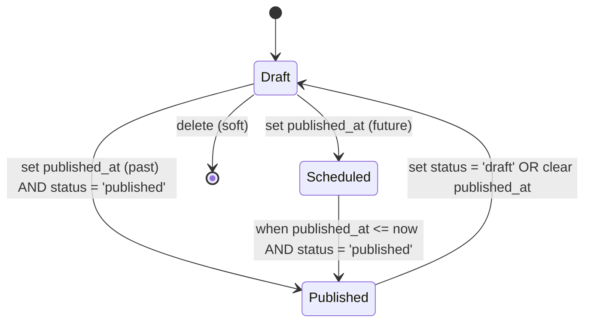

# Entry (записи)

**Entry** — это запись контента, экземпляр [PostType](post-types.md). Например, конкретная статья, страница, событие или товар.

## Модель данных

**Таблица**: `entries`

```php
Entry {
  id: bigint (PK)
  post_type_id: bigint (FK → post_types.id)
  author_id: bigint (FK → users.id)
  slug: string (indexed)
  title: string
  data_json: json                  // кастомные поля
  seo_json: json                   // SEO метаданные
  status: enum('draft', 'published')
  published_at: ?datetime
  created_at: datetime
  updated_at: datetime
  deleted_at: ?datetime            // soft delete
}
```

**Связи**:
- `belongsTo(PostType)` — тип контента
- `belongsTo(User, 'author_id')` — автор
- `hasMany(EntrySlug)` — история URL
- `belongsToMany(Term)` via `entry_term` — категории/теги
- `belongsToMany(Media)` via `entry_media` — медиафайлы

**Файл**: `app/Models/Entry.php`

## Publishing Flow

Entry проходит через несколько состояний:



### 1. Draft (черновик)

```php
Entry::create([
    'post_type_id' => $postType->id,
    'author_id' => auth()->id(),
    'title' => 'My Draft',
    'slug' => 'my-draft',
    'status' => 'draft',
    'published_at' => null,  // не опубликовано
]);
```

**Характеристики**:
- `status = 'draft'`
- `published_at = null`
- Видно только автору и админам
- Не индексируется поиском

---

### 2. Scheduled (запланировано)

```php
$entry->update([
    'published_at' => Carbon::parse('2025-12-01 10:00:00'),
]);
```

**Характеристики**:
- `published_at` в будущем
- Автоматически станет published, когда `published_at <= now`
- Видно в админке как "Запланировано"

**Проверка** (например, через Scheduler):

```php
// app/Console/Kernel.php

$schedule->call(function () {
    Entry::where('status', 'draft')
        ->where('published_at', '<=', now())
        ->update(['status' => 'published']);
})->everyMinute();
```

---

### 3. Published (опубликовано)

```php
$entry->update([
    'status' => 'published',
    'published_at' => now(),
]);
```

**Характеристики**:
- `status = 'published'`
- `published_at <= now()`
- Видно всем пользователям
- Индексируется поиском

**Scope**:
```php
Entry::published()->get();
// WHERE status = 'published' AND published_at IS NOT NULL AND published_at <= NOW()
```

---

### 4. Deleted (удалено)

```php
$entry->delete();  // soft delete
```

**Характеристики**:
- `deleted_at` установлен
- Скрыто везде, кроме админки с фильтром "trashed"
- Можно восстановить: `$entry->restore()`

## data_json (кастомные поля)

Структура зависит от `PostType.options_json['fields']`:

### Пример для Article

```json
{
  "subtitle": "Краткое описание статьи",
  "featured": true,
  "read_time": 5,
  "custom_field": "any value"
}
```

### Валидация

При создании/обновлении проверяем соответствие схеме PostType:

```php
$allowedFields = $entry->postType->options_json['fields'] ?? [];
$providedFields = array_keys($request->input('data_json', []));

$invalidFields = array_diff($providedFields, $allowedFields);

if ($invalidFields) {
    throw ValidationException::withMessages([
        'data_json' => "Unknown fields: " . implode(', ', $invalidFields),
    ]);
}
```

## seo_json (SEO метаданные)

```json
{
  "meta_title": "Custom Title for Search Engines",
  "meta_description": "Description for search results",
  "og:title": "Title for social sharing",
  "og:description": "Description for social sharing",
  "og:image": "/media/123/featured.jpg",
  "canonical_url": "https://example.com/articles/my-post"
}
```

**Использование в шаблоне**:

```blade
<title>{{ $entry->seo_json['meta_title'] ?? $entry->title }}</title>
<meta name="description" content="{{ $entry->seo_json['meta_description'] ?? '' }}">
<meta property="og:title" content="{{ $entry->seo_json['og:title'] ?? $entry->title }}">
```

## Связи

### Terms (категории/теги)

```php
// Привязать термины
$entry->terms()->attach([1, 2, 3]);

// Синхронизировать (заменить все)
$entry->terms()->sync([2, 4, 5]);

// Получить термины
$entry->terms; // Collection<Term>
```

**Таблица**: `entry_term`

```sql
entry_id | term_id
---------+--------
1        | 2
1        | 5
```

---

### Media (медиафайлы)

```php
// Прикрепить медиа с метаданными
$entry->media()->attach($mediaId, [
    'field_key' => 'featured_image',
    'order' => 0,
]);

$entry->media()->attach($mediaId2, [
    'field_key' => 'gallery',
    'order' => 1,
]);

// Получить featured image
$featuredMedia = $entry->media()
    ->wherePivot('field_key', 'featured_image')
    ->first();

// Получить галерею
$gallery = $entry->media()
    ->wherePivot('field_key', 'gallery')
    ->orderByPivot('order')
    ->get();
```

**Таблица**: `entry_media`

```sql
entry_id | media_id | field_key       | order
---------+----------+-----------------+------
1        | 10       | featured_image  | 0
1        | 11       | gallery         | 1
1        | 12       | gallery         | 2
```

## Scopes

### published()

```php
Entry::published()->get();
```

Возвращает только опубликованные entries:
- `status = 'published'`
- `published_at IS NOT NULL`
- `published_at <= now()`

### ofType(string $postTypeSlug)

```php
Entry::ofType('article')->get();
```

Фильтр по типу контента.

### Кастомные scopes

```php
// app/Models/Entry.php

public function scopeFeatured(Builder $q): Builder
{
    return $q->whereRaw("JSON_EXTRACT(data_json, '$.featured') = true");
}

public function scopeRecent(Builder $q, int $days = 7): Builder
{
    return $q->where('created_at', '>=', now()->subDays($days));
}
```

Использование:

```php
Entry::published()->featured()->recent(30)->get();
```

## Observers

### EntryObserver

**Файл**: `app/Observers/EntryObserver.php`

**События**:

#### created

```php
public function created(Entry $entry): void
{
    // Создать entry_slug
    EntrySlug::create([
        'entry_id' => $entry->id,
        'slug' => $entry->slug,
        'is_current' => true,
        'created_at' => now(),
    ]);
}
```

#### updating

```php
public function updating(Entry $entry): void
{
    if ($entry->isDirty('slug')) {
        // Старый slug → is_current = false
        EntrySlug::where('entry_id', $entry->id)
            ->where('is_current', true)
            ->update(['is_current' => false]);
        
        // Новый slug → создать
        EntrySlug::create([
            'entry_id' => $entry->id,
            'slug' => $entry->slug,
            'is_current' => true,
            'created_at' => now(),
        ]);
        
        // Событие для кэша
        event(new EntrySlugChanged($entry, $entry->getOriginal('slug'), $entry->slug));
    }
}
```

#### deleted

```php
public function deleted(Entry $entry): void
{
    // Логирование, инвалидация кэша и т.д.
    Cache::forget("entry:{$entry->id}");
}
```

## API

### Получение списка статусов

**Endpoint**: `GET /api/v1/admin/entries/statuses`

**Response**: `200 OK`
```json
{
  "data": [
    "draft",
    "published"
  ]
}
```

**Описание**: Возвращает список возможных статусов для Entry. Требует авторизации и права `viewAny` на `Entry`.

---

### Создание Entry

**Endpoint**: `POST /api/v1/admin/entries`

**Request**:
```json
{
  "post_type_id": 1,
  "title": "Laravel 12 Released",
  "slug": "laravel-12-released",
  "data_json": {
    "subtitle": "What's new in Laravel 12",
    "featured": true,
    "read_time": 8
  },
  "seo_json": {
    "meta_description": "Learn about new features in Laravel 12"
  },
  "status": "draft",
  "term_ids": [1, 2],
  "media_ids": [10]
}
```

**Response**: `201 Created`

---

### Публикация Entry

**Endpoint**: `PUT /api/v1/admin/entries/{id}`

**Request**:
```json
{
  "status": "published",
  "published_at": "2025-11-08T12:00:00Z"
}
```

---

### Получение списка (public)

**Endpoint**: `GET /api/v1/entries`

**Query**:
- `?post_type=article` — фильтр по типу
- `?term_id=5` — фильтр по термину
- `?page=2` — пагинация

**Response**:
```json
{
  "data": [
    {
      "id": 1,
      "title": "Laravel 12 Released",
      "slug": "laravel-12-released",
      "excerpt": "...",
      "published_at": "2025-11-08T12:00:00Z",
      "post_type": {
        "slug": "article",
        "name": "Статья"
      },
      "terms": [...]
    }
  ],
  "links": {...},
  "meta": {...}
}
```

---

### Получение по slug

**Endpoint**: `GET /api/v1/entries/{slug}`

**Response**:
```json
{
  "data": {
    "id": 1,
    "title": "Laravel 12 Released",
    "slug": "laravel-12-released",
    "data_json": {
      "subtitle": "...",
      "featured": true
    },
    "seo_json": {...},
    "published_at": "2025-11-08T12:00:00Z",
    "author": {...},
    "terms": [...],
    "media": [...]
  }
}
```

## Best Practices

### ✅ DO

- Используйте `published()` scope для публичных запросов
- Валидируйте `data_json` на соответствие PostType.fields
- Заполняйте `seo_json` для всех публичных entries
- Используйте soft deletes (`deleted_at`)
- Логируйте изменения через Audit

### ❌ DON'T

- Не возвращайте draft entries в публичном API
- Не храните чувствительные данные в `data_json` (используйте зашифрованные поля)
- Не изменяйте `slug` без предупреждения пользователя (ломает внешние ссылки, хотя будет 301)

## Производительность

### Eager Loading

```php
Entry::with(['postType', 'author', 'terms', 'media'])
    ->published()
    ->paginate(20);
```

Вместо N+1 запросов.

### Индексы

Убедитесь, что есть индексы на:
- `post_type_id`
- `slug`
- `author_id`
- `status`
- `published_at`

См. миграцию `create_entries_table`.

## Связанные страницы

- [Post Types](post-types.md) — типы контента
- [Slugs & 301](slugs.md) — маршрутизация
- [Taxonomy](taxonomy.md) — категоризация
- [Media](media.md) — медиатека
- Scribe API Reference (`../_generated/api-docs/index.html`) — endpoints

---

> 💡 **Tip**: Используйте `published_at` для планирования публикаций. Настройте Laravel Scheduler для автоматической публикации.

