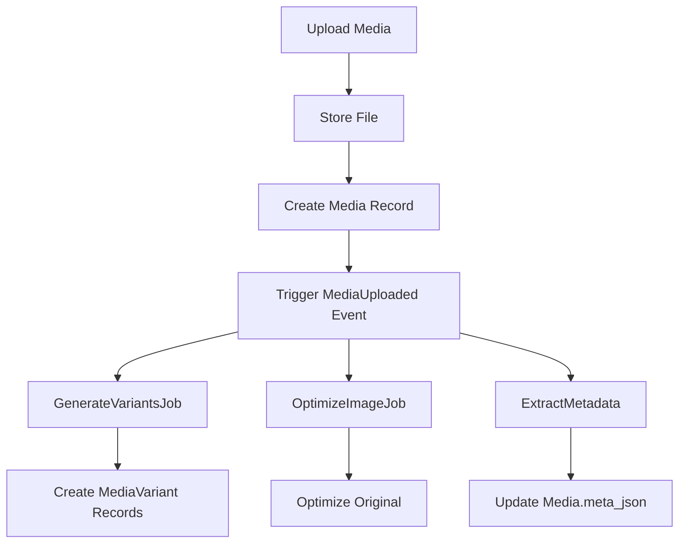

# Media Pipeline

> ⚠️ **Auto-generated**. Do not edit manually. Run `php artisan docs:media` to update.

_Last generated: 2025-11-13 09:08:42_

## Storage Configuration

| Setting | Value |
|---------|-------|
| driver | `local` |
| disk | `local` |
| path | `C:\Users\dattebayo\Desktop\proj\stupidCms\storage\app/private` |

## Upload Settings

| Setting | Value |
|---------|-------|
| Max Size | 10 MB |
| Allowed MIME Types | jpg, jpeg, png, gif, webp, pdf, doc, docx |
| Path Pattern | `media/{year}/{month}/{day}` |

## Image Variants

| Variant | Width | Height | Fit |
|---------|-------|--------|-----|
| `thumbnail` | 150px | 150px | crop |
| `medium` | 600px | 600px | max |
| `large` | 1200px | 1200px | max |

## Optimization

```php
enabled: false
quality: 80
format: webp
```

## Pipeline Flow



## Events & Listeners

### `MediaUploaded`

**Listeners**:

- `GenerateMediaVariants`
- `OptimizeImage`
- `ExtractMetadata`

## Jobs

### `GenerateVariantsJob`

Generate image variants (thumbnails)

**Queue**: `default`

### `OptimizeImageJob`

Optimize image quality and size

**Queue**: `default`

