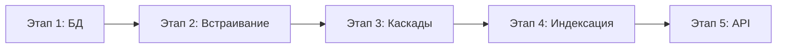

# План реализации: Документная система с path-индексацией

> **Статус:** Ready for development  
> **Версия:** 1.0  
> **Дата:** 2025-11-20  
> **Основано на:** `document_path1.md`, `document_path1_task_breakdown_plan.md`

---

## Оглавление

1. [Архитектурные решения](#1-архитектурные-решения)
2. [Roadmap и этапы](#2-roadmap-и-этапы)
3. [Sprint Planning](#3-sprint-planning)
4. [Детальные задачи](#4-детальные-задачи)
5. [Definition of Done](#5-definition-of-done)
6. [Риски и митигация](#6-риски-и-митигация)
7. [Команды для разработчиков](#7-команды-для-разработчиков)

---

## 1. Архитектурные решения

### 1.1. Принятые решения ✅

| Решение                   | Значение              | Обоснование                         |
| ------------------------- | --------------------- | ----------------------------------- |
| **MySQL версия**          | 8.0.16+               | Нативные CHECK constraints          |
| **Таблица Entry**         | Отдельная pivot       | Изоляция, независимая эволюция      |
| **Режим работы**          | Только с blueprint    | Упрощение, фокус на качестве        |
| **Материализация**        | Синхронная            | Немедленная консистентность         |
| **Валидаторы paths**      | validation_rules JSON | Гибкая валидация данных             |
| **SoftDeletes blueprint** | Нет                   | Упрощение каскадов                  |
| **Лимит вложенности**     | MAX_EMBED_DEPTH = 5   | Защита стека, разумное ограничение  |
| **Автопереименование**    | Нет                   | Явные ошибки, контроль разработчика |

### 1.2. Технические ограничения

```
┌─────────────────────────────────────────┐
│ ТЕХНИЧЕСКИЕ ЛИМИТЫ                      │
├─────────────────────────────────────────┤
│ MAX_EMBED_DEPTH          = 5            │
│ MAX_PATHS_PER_BLUEPRINT  = 500          │
│ MAX_BLUEPRINT_IN_GRAPH   = 200          │
│ MATERIALIZATION_TIMEOUT  = 120 секунд   │
│ REINDEX_BATCH_SIZE       = 100 entries  │
└─────────────────────────────────────────┘
```

---

## 2. Roadmap и этапы

### 2.1. Timeline (8 недель для 2 разработчиков)

```
Week 1-2: Этап 1 (БД и модели)
Week 3-5: Этап 2 (Встраивание)
Week 6:   Этап 3 (Каскады)
Week 7:   Этап 4 (Индексация)
Week 8:   Этап 5 (API + тесты)
```

### 2.2. Milestones

```
M1 ✅ БД готова              (Week 2)
M2 ✅ Встраивание работает    (Week 5)
M3 ✅ Каскады работают        (Week 6)
M4 ✅ Индексация работает     (Week 7)
M5 ✅ Production-ready        (Week 8)
```

### 2.3. Этапы разработки



---

## 3. Sprint Planning

### Sprint 1 (Week 1): Фундамент БД

**Цель:** Создать схему БД с миграциями и базовыми моделями

**Задачи:**

-   [ ] TASK-001: Миграция `blueprints`
-   [ ] TASK-002: Миграция `paths` (без FK blueprint_embed_id)
-   [ ] TASK-003: Миграция `blueprint_embeds`
-   [ ] TASK-004: Миграция FK `paths.blueprint_embed_id`
-   [ ] TASK-005: Модель `Blueprint` + связи
-   [ ] TASK-006: Модель `Path` + связи + $guarded
-   [ ] TASK-007: Модель `BlueprintEmbed` + связи
-   [ ] TASK-008: Фабрики для моделей
-   [ ] TASK-009: Unit-тесты моделей

**Критерий готовности Sprint 1:**

-   ✅ Все 4 миграции применяются без ошибок
-   ✅ Модели создаются через фабрики
-   ✅ Связи работают корректно
-   ✅ Тесты моделей зелёные

---

### Sprint 2 (Week 2): Валидация графа

**Цель:** Реализовать проверку циклов и граф зависимостей

**Задачи:**

-   [ ] TASK-010: `CyclicDependencyValidator::ensureNoCyclicDependency()`
-   [ ] TASK-011: `CyclicDependencyValidator::hasPathTo()` (BFS)
-   [ ] TASK-012: Исключение `CyclicDependencyException`
-   [ ] TASK-013: Unit-тесты валидации циклов
    -   Self-embed (A → A)
    -   Прямой цикл (A → B → A)
    -   Транзитивный цикл (A → B → C → A)
    -   Множественное без цикла
-   [ ] TASK-014: `BlueprintDependencyService::getAllDependentBlueprintIds()`

**Критерий готовности Sprint 2:**

-   ✅ Проверка циклов работает корректно
-   ✅ Тесты покрывают все сценарии циклов
-   ✅ Граф зависимостей строится корректно

---

### Sprint 3 (Week 3): PRE-CHECK и подготовка к материализации

**Цель:** Реализовать валидацию конфликтов full_path

**Задачи:**

-   [ ] TASK-015: `PathConflictValidator::validateNoPathConflictsBeforeMaterialization()`
-   [ ] TASK-016: `PathConflictValidator::collectFuturePathsRecursive()` (рекурсивный сбор)
-   [ ] TASK-017: Исключение `PathConflictException` с деталями
-   [ ] TASK-018: Unit-тесты PRE-CHECK
    -   Конфликт с собственным полем
    -   Конфликт между двумя embeds
    -   Нет конфликта (успех)
-   [ ] TASK-019: Хелпер `Path::computeFullPath()`

**Критерий готовности Sprint 3:**

-   ✅ PRE-CHECK детектирует конфликты ДО вставки
-   ✅ Сообщения об ошибках понятны
-   ✅ Тесты покрывают edge cases

---

### Sprint 4-5 (Week 4-5): Рекурсивная материализация

**Цель:** Реализовать ядро системы — материализацию с транзитивностью

**Задачи:**

-   [ ] TASK-020: `BlueprintStructureService::materializeEmbeddedBlueprint()`
    -   DB::transaction
    -   PRE-CHECK вызов
    -   Удаление старых копий
    -   Рекурсивный копировщик
-   [ ] TASK-021: `BlueprintStructureService::copyBlueprintRecursive()`
    -   Копирование собственных paths
    -   Рекурсия по вложенным embeds
    -   Карта id соответствий
    -   Вычисление full_path
    -   Проверка MAX_EMBED_DEPTH = 5
-   [ ] TASK-022: `BlueprintStructureService::createEmbed()`
    -   Валидация циклов
    -   Создание BlueprintEmbed
    -   Материализация
-   [ ] TASK-023: `BlueprintStructureService::deleteEmbed()`
    -   Удаление BlueprintEmbed
    -   Каскадное удаление копий
-   [ ] TASK-024: Unit-тесты материализации
    -   Простое встраивание (A → B)
    -   Множественное (Address дважды в Company)
    -   Транзитивное (D → C → A → B)
    -   Многоуровневое (author.contacts ← ContactInfo)
    -   Превышение MAX_EMBED_DEPTH
-   [ ] TASK-025: Integration-тест full flow

**Критерий готовности Sprint 4-5:**

-   ✅ Материализация работает рекурсивно
-   ✅ Все транзитивные поля копируются
-   ✅ Превышение глубины бросает исключение
-   ✅ Integration-тест проходит

---

### Sprint 6 (Week 6): Каскадные события

**Цель:** Автоматическое распространение изменений структуры

**Задачи:**

-   [ ] TASK-026: Event `BlueprintStructureChanged`
-   [ ] TASK-027: Listener `RematerializeEmbeds`
    -   Защита от зацикливания (processedBlueprints)
    -   Рематериализация embeds
    -   Каскадное событие для родителей
-   [ ] TASK-028: Интеграция с `BlueprintStructureService`
-   [ ] TASK-029: Unit-тесты каскадов
    -   Изменение A → рематериализация B
    -   Транзитивная цепочка (Geo → Address → Company)
    -   Защита от циклов в событиях
-   [ ] TASK-030: Логирование каскадных операций

**Критерий готовности Sprint 6:**

-   ✅ Изменение структуры распространяется автоматически
-   ✅ Цепочки обрабатываются корректно
-   ✅ Нет зацикливаний

---

### Sprint 7 (Week 7): Индексация данных

**Цель:** Реализовать индексацию doc_values/doc_refs

**Задачи:**

-   [ ] TASK-031: Миграция `entries` (pivot)
-   [ ] TASK-032: Миграция `doc_values`
-   [ ] TASK-033: Миграция `doc_refs`
-   [ ] TASK-034: Модель `Entry` (pivot)
-   [ ] TASK-035: Модели `DocValue`, `DocRef`
-   [ ] TASK-036: `EntryIndexer::index(Entry $entry)`
    -   Очистка старых индексов
    -   Обход paths
    -   Извлечение из data_json
    -   Сохранение doc_values/doc_refs
    -   Обработка cardinality=many
-   [ ] TASK-037: Observer `EntryObserver`
    -   Автоиндексация при saved()
    -   Очистка при deleted()
-   [ ] TASK-038: Job `ReindexBlueprintEntries`
-   [ ] TASK-039: Unit-тесты индексации
    -   Скалярные значения
    -   Массивы (array_index)
    -   Ссылки (refs)
-   [ ] TASK-040: Feature-тесты Entry CRUD

**Критерий готовности Sprint 7:**

-   ✅ Entry индексируются автоматически
-   ✅ doc_values заполняются корректно
-   ✅ array_index работает для many

---

### Sprint 8 (Week 8): API и финализация

**Цель:** REST API, Query Builder, финальные тесты

**Задачи:**

-   [ ] TASK-041: Trait `HasDocumentData`
    -   `wherePath($path, $operator, $value)`
    -   `wherePathIn($path, $values)`
    -   `whereRef($path, $entryId)`
    -   `orderByPath($path, $direction)`
-   [ ] TASK-042: Controller `BlueprintController` (CRUD)
-   [ ] TASK-043: Controller `PathController` (CRUD с валидацией readonly)
-   [ ] TASK-044: Controller `BlueprintEmbedController` (CRUD)
-   [ ] TASK-045: Controller `EntryController` (CRUD с индексацией)
-   [ ] TASK-046: Resources (BlueprintResource, PathResource, EntryResource)
-   [ ] TASK-047: Policies (авторизация)
-   [ ] TASK-048: Feature-тесты API
-   [ ] TASK-049: Integration-тесты full flow
-   [ ] TASK-050: Performance-тесты (опционально)
-   [ ] TASK-051: Scribe API documentation
-   [ ] TASK-052: README с примерами

**Критерий готовности Sprint 8:**

-   ✅ API работает полностью
-   ✅ wherePath запросы корректны
-   ✅ Документация актуальна
-   ✅ Production-ready

---

## 4. Детальные задачи

### TASK-001: Миграция `blueprints`

**Файл:** `database/migrations/YYYY_MM_DD_000001_create_blueprints_table.php`

**Код:**

```php
Schema::create('blueprints', function (Blueprint $table) {
    $table->id();
    $table->string('name');
    $table->string('code')->unique();
    $table->text('description')->nullable();
    $table->timestamps();
});
```

**Acceptance Criteria:**

-   ✅ Миграция применяется без ошибок
-   ✅ UNIQUE constraint на code
-   ✅ Rollback работает

**Трудоёмкость:** 30 минут

---

### TASK-002: Миграция `paths` (без FK blueprint_embed_id)

**Файл:** `database/migrations/YYYY_MM_DD_000002_create_paths_table.php`

**Код:**

```php
Schema::create('paths', function (Blueprint $table) {
    $table->id();
    $table->foreignId('blueprint_id')->constrained()->cascadeOnDelete();
    $table->foreignId('source_blueprint_id')->nullable()
        ->constrained('blueprints')->restrictOnDelete();
    $table->unsignedBigInteger('blueprint_embed_id')->nullable(); // FK позже!
    $table->foreignId('parent_id')->nullable()
        ->constrained('paths')->cascadeOnDelete();

    $table->string('name');
    $table->string('full_path', 2048);
    $table->enum('data_type', ['string','text','int','float','bool','date','datetime','json','ref']);
    $table->enum('cardinality', ['one','many'])->default('one');
    $table->boolean('is_required')->default(false);
    $table->boolean('is_indexed')->default(false);
    $table->boolean('is_readonly')->default(false);
    $table->json('validation_rules')->nullable(); // NEW!
    $table->integer('sort_order')->default(0);
    $table->timestamps();

    $table->unique(['blueprint_id', 'full_path']);

    // CHECK constraint для инварианта readonly
    DB::statement('ALTER TABLE paths ADD CONSTRAINT chk_paths_readonly_consistency CHECK (
        (source_blueprint_id IS NULL AND blueprint_embed_id IS NULL)
        OR (source_blueprint_id IS NOT NULL AND blueprint_embed_id IS NOT NULL AND is_readonly = 1)
    )');

    $table->index('blueprint_id');
    $table->index('source_blueprint_id');
    $table->index(['blueprint_id', 'parent_id', 'sort_order']);
});
```

**Acceptance Criteria:**

-   ✅ Миграция применяется
-   ✅ CHECK constraint работает
-   ✅ Индексы созданы
-   ✅ validation_rules поле добавлено

**Трудоёмкость:** 2 часа

---

### TASK-003: Миграция `blueprint_embeds`

**Файл:** `database/migrations/YYYY_MM_DD_000003_create_blueprint_embeds_table.php`

**Код:**

```php
Schema::create('blueprint_embeds', function (Blueprint $table) {
    $table->id();
    $table->foreignId('blueprint_id')->constrained()->cascadeOnDelete();
    $table->foreignId('embedded_blueprint_id')
        ->constrained('blueprints')->restrictOnDelete();
    $table->foreignId('host_path_id')->nullable()
        ->constrained('paths')->cascadeOnDelete();
    $table->timestamps();

    $table->unique(['blueprint_id', 'embedded_blueprint_id', 'host_path_id']);
    $table->index('embedded_blueprint_id');
    $table->index('blueprint_id');
});
```

**Acceptance Criteria:**

-   ✅ Миграция применяется
-   ✅ UNIQUE constraint работает
-   ✅ FK на paths работает

**Трудоёмкость:** 1 час

---

### TASK-004: Миграция FK `paths.blueprint_embed_id`

**Файл:** `database/migrations/YYYY_MM_DD_000004_add_blueprint_embed_fk_to_paths.php`

**Код:**

```php
Schema::table('paths', function (Blueprint $table) {
    $table->foreign('blueprint_embed_id')
        ->references('id')
        ->on('blueprint_embeds')
        ->cascadeOnDelete();

    $table->index('blueprint_embed_id');
});
```

**Acceptance Criteria:**

-   ✅ FK добавляется без ошибок
-   ✅ Каскадное удаление работает

**Трудоёмкость:** 30 минут

---

### TASK-020: `BlueprintStructureService::materializeEmbeddedBlueprint()`

**Файл:** `app/Domain/Blueprints/Services/BlueprintStructureService.php`

**Код (псевдокод):**

```php
public function materializeEmbeddedBlueprint(BlueprintEmbed $embed): void
{
    $hostBlueprint     = $embed->blueprint;
    $embeddedBlueprint = $embed->embeddedBlueprint;
    $hostPath          = $embed->hostPath;

    DB::transaction(function () use ($embed, $hostBlueprint, $embeddedBlueprint, $hostPath) {
        $baseParentId   = $hostPath?->id;
        $baseParentPath = $hostPath?->full_path;

        // 1. PRE-CHECK
        $this->pathConflictValidator->validateNoPathConflictsBeforeMaterialization(
            $embeddedBlueprint,
            $hostBlueprint,
            $baseParentPath
        );

        // 2. Удалить старые копии
        Path::where('blueprint_embed_id', $embed->id)->delete();

        // 3. Рекурсивно скопировать
        $this->copyBlueprintRecursive(
            blueprint:       $embeddedBlueprint,
            hostBlueprint:   $hostBlueprint,
            baseParentId:    $baseParentId,
            baseParentPath:  $baseParentPath,
            rootEmbed:       $embed,
            depth:           0  // NEW!
        );
    }, attempts: 3);
}
```

**Acceptance Criteria:**

-   ✅ Транзакция атомарна
-   ✅ PRE-CHECK вызывается ДО копирования
-   ✅ Старые копии удаляются
-   ✅ Рекурсия работает

**Трудоёмкость:** 4 часа

---

### TASK-021: `BlueprintStructureService::copyBlueprintRecursive()`

**Ключевые моменты:**

```php
private function copyBlueprintRecursive(
    Blueprint $blueprint,
    Blueprint $hostBlueprint,
    ?int $baseParentId,
    ?string $baseParentPath,
    BlueprintEmbed $rootEmbed,
    int $depth = 0
): void {
    // Защита от переполнения
    if ($depth > self::MAX_EMBED_DEPTH) {
        throw new MaxEmbedDepthExceededException(
            "Maximum embed depth of " . self::MAX_EMBED_DEPTH . " exceeded"
        );
    }

    // 1. Копируем собственные paths
    $sourcePaths = $blueprint->paths()
        ->whereNull('source_blueprint_id')
        ->orderByRaw('LENGTH(full_path), full_path')
        ->get();

    $idMap = [];
    $pathMap = [];

    foreach ($sourcePaths as $source) {
        $copy = $source->replicate([
            'blueprint_id', 'parent_id', 'full_path',
            'source_blueprint_id', 'blueprint_embed_id', 'is_readonly'
        ]);

        $copy->blueprint_id        = $hostBlueprint->id;
        $copy->source_blueprint_id = $blueprint->id;
        $copy->blueprint_embed_id  = $rootEmbed->id;
        $copy->is_readonly         = true;

        // Вычисляем parent и full_path
        if ($source->parent_id === null) {
            $parentId   = $baseParentId;
            $parentPath = $baseParentPath;
        } else {
            $parentId   = $idMap[$source->parent_id] ?? null;
            $parentPath = $pathMap[$source->parent_id] ?? null;
        }

        $copy->parent_id = $parentId;
        $copy->full_path = $parentPath
            ? $parentPath . '.' . $copy->name
            : $copy->name;

        $copy->save();

        $idMap[$source->id]   = $copy->id;
        $pathMap[$source->id] = $copy->full_path;
    }

    // 2. Рекурсия по вложенным embeds
    foreach ($blueprint->embeds as $innerEmbed) {
        $innerHostPath = $innerEmbed->hostPath;

        if ($innerHostPath) {
            $sourceHostId = $innerHostPath->id;
            $newHostId    = $idMap[$sourceHostId] ?? null;
            $newHostPath  = $pathMap[$sourceHostId] ?? null;

            if (!$newHostId) continue;

            $this->copyBlueprintRecursive(
                blueprint:       $innerEmbed->embeddedBlueprint,
                hostBlueprint:   $hostBlueprint,
                baseParentId:    $newHostId,
                baseParentPath:  $newHostPath,
                rootEmbed:       $rootEmbed,
                depth:           $depth + 1  // Увеличиваем глубину
            );
        } else {
            // Встраивание в корень внутри blueprint
            $this->copyBlueprintRecursive(
                blueprint:       $innerEmbed->embeddedBlueprint,
                hostBlueprint:   $hostBlueprint,
                baseParentId:    $baseParentId,
                baseParentPath:  $baseParentPath,
                rootEmbed:       $rootEmbed,
                depth:           $depth + 1
            );
        }
    }
}
```

**Acceptance Criteria:**

-   ✅ Собственные paths копируются
-   ✅ Вложенные embeds разворачиваются рекурсивно
-   ✅ full_path вычисляется корректно
-   ✅ MAX_EMBED_DEPTH проверяется
-   ✅ blueprint_embed_id = rootEmbed.id для ВСЕХ копий

**Трудоёмкость:** 8 часов

---

## 5. Definition of Done

### 5.1. DoD для задачи

-   [ ] Код написан и работает локально
-   [ ] Unit-тесты написаны и проходят
-   [ ] PHPDoc комментарии актуальны
-   [ ] PSR-12 соблюдён (Laravel Pint)
-   [ ] Code review пройден
-   [ ] Нет linter errors
-   [ ] Нет SQL N+1 queries (проверено через Debugbar)

### 5.2. DoD для Sprint

-   [ ] Все задачи Sprint выполнены
-   [ ] Feature-тесты проходят
-   [ ] Integration-тесты проходят (если есть)
-   [ ] Документация обновлена
-   [ ] `php artisan test` зелёный
-   [ ] `composer scribe:gen` успешен
-   [ ] Demo на staging

### 5.3. DoD для Milestone

-   [ ] Все Sprint Milestone выполнены
-   [ ] Performance-тесты проходят (если есть)
-   [ ] Scribe-документация актуальна
-   [ ] README обновлён
-   [ ] Rollback-стратегия проверена
-   [ ] Production deployment успешен

---

## 6. Риски и митигация

| Риск                                                 | Вероятность | Влияние     | Митигация                           |
| ---------------------------------------------------- | ----------- | ----------- | ----------------------------------- |
| **Переполнение стека при глубокой рекурсии**         | Средняя     | Высокое     | MAX_EMBED_DEPTH = 5 + unit-тест     |
| **SQL timeout при материализации больших blueprint** | Средняя     | Высокое     | DB::transaction timeout 120s        |
| **Конфликты full_path не детектируются**             | Низкая      | Критическое | PRE-CHECK обязателен, 100% coverage |
| **N+1 queries при индексации**                       | Высокая     | Среднее     | Eager loading, профилирование       |
| **Каскадные события зацикливаются**                  | Низкая      | Критическое | processedBlueprints + unit-тест     |
| **Concurrent modification (два пользователя)**       | Средняя     | Среднее     | Optimistic locking (updated_at)     |
| **Граф зависимостей строится медленно**              | Средняя     | Низкое      | Closure Table (Could Have)          |

---

## 7. Команды для разработчиков

### 7.1. Первоначальная настройка

```bash
# Клонировать репозиторий stupidCMS
git checkout -b feature/blueprint-system

# Применить миграции (в правильном порядке!)
php artisan migrate

# Запустить сидеры (если есть)
php artisan db:seed --class=BlueprintSeeder
```

### 7.2. Workflow разработки

```bash
# Создать новую миграцию
php artisan make:migration create_blueprints_table

# Создать модель с миграцией
php artisan make:model Blueprint -m

# Создать фабрику
php artisan make:factory BlueprintFactory

# Создать тест
php artisan make:test BlueprintStructureServiceTest --unit

# Запустить тесты
php artisan test --filter BlueprintStructureServiceTest

# Проверить PSR-12
./vendor/bin/pint

# Проверить статику (если установлен phpstan)
./vendor/bin/phpstan analyse app/Domain/Blueprints

# Сгенерировать API документацию
composer scribe:gen
```

### 7.3. Debugging

```bash
# Включить query log
DB::enableQueryLog();
// ваш код
dd(DB::getQueryLog());

# Профилирование через Telescope
php artisan telescope:install

# Проверка индексов
EXPLAIN SELECT * FROM doc_values WHERE path_id = 100;
```

### 7.4. Миграция и rollback

```bash
# Применить все миграции
php artisan migrate

# Откатить последний батч
php artisan migrate:rollback

# Откатить конкретную миграцию
php artisan migrate:rollback --step=1

# Пересоздать БД
php artisan migrate:fresh --seed
```

---

## 8. Метрики и мониторинг

### 8.1. Ключевые метрики

```
Materialization.duration     < 5 секунд  (для blueprint с 100 paths)
EntryIndexing.duration       < 500 ms    (для entry с 50 полями)
wherePath.query.duration     < 100 ms    (JOIN на doc_values)
CyclicCheck.duration         < 50 ms     (BFS на графе 100 blueprint)
PRE-CHECK.duration           < 200 ms    (сбор 500 paths)
```

### 8.2. Мониторинг

```php
// В BlueprintStructureService::materializeEmbeddedBlueprint()
$start = microtime(true);
// ... материализация ...
$duration = microtime(true) - $start;

Log::info('Blueprint materialized', [
    'blueprint_id' => $hostBlueprint->id,
    'embed_id' => $embed->id,
    'duration_ms' => $duration * 1000,
    'paths_copied' => $pathsCopiedCount,
]);
```

---

## 9. Следующие шаги

1. **Week 1:** Начать Sprint 1 (БД и модели)
2. **Daily standups:** Синхронизация прогресса
3. **Code reviews:** Каждый PR перед мержем
4. **Demo на staging:** После каждого Sprint
5. **Ретроспектива:** После каждого Milestone

---

**Документ готов к началу разработки. Удачи! 🚀**
